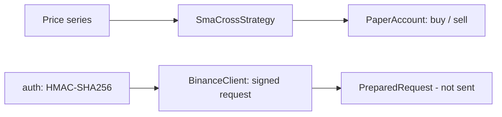

<p align="center">
  
</p>

<h1 align="center">Binance Trading Bot</h1>

<p align="center">
  <strong>Binance API trading bot with HMAC request signing and paper trading — in Python.</strong><br>
  Build correctly signed Binance requests offline, dry-run a strategy on the paper account, then wire up live.
</p>

<p align="center">
  <em>Built and maintained by <a href="https://viprasol.com">Viprasol Tech</a> — Fintech Experts. Full-Stack Builders.</em>
</p>

<p align="center">
  <a href="https://github.com/Viprasol-Tech/binance-trading-bot/actions/workflows/ci.yml"></a>
  <a href="LICENSE"></a>
  
  <a href="https://t.me/viprasol_help"></a>
  <a href="https://github.com/Viprasol-Tech/binance-trading-bot/stargazers"></a>
</p>

---

> ## ⚠️ Disclaimer
> This software is for **educational purposes only** and is **not financial advice**. Cryptocurrency trading is highly volatile and involves substantial risk, including the **total loss of capital**. Paper-trading results are **not** indicative of future performance. Always test on the paper account or Binance testnet first and comply with Binance's terms and your local laws. **Use at your own risk** — Viprasol Tech assumes no responsibility for your trading results.

---

## ✨ Features

- 🔐 **Binance HMAC signing** — `sign_query` reproduces Binance's exact HMAC-SHA256 `signature` scheme, byte-for-byte.
- 🧱 **Offline request builder** — `BinanceClient` prepares signed/unsigned requests (URL, `X-MBX-APIKEY` header, query) **without any network call**.
- 🏜️ **Paper account** — cash + per-symbol positions, market buy/sell with strict balance checks and mark-to-market equity.
- 📈 **SMA-cross strategy** — a tiny, testable dual moving-average crossover signal.
- 🖥️ **CLI** — `binance-trading-bot demo` builds a signed order and runs paper trades end to end.
- ⚙️ **Modern tooling** — ruff, mypy (strict), pytest, GitHub Actions CI.

## 🚀 Quickstart

```bash
git clone https://github.com/Viprasol-Tech/binance-trading-bot.git
cd binance-trading-bot
python -m pip install -e ".[dev]"

# Build a signed request and run a few paper trades:
binance-trading-bot demo
binance-trading-bot demo --symbol ETHUSDT --start-cash 5000
```

## 🧩 Sign a request and place a paper trade

```python
from binance_trading_bot.client import BinanceClient
from binance_trading_bot.paper import PaperAccount

# Prepare a signed MARKET order (nothing is sent over the network):
client = BinanceClient("API_KEY", "API_SECRET")
req = client.prepare_new_order("BTCUSDT", "BUY", 0.01, timestamp_ms=1_700_000_000_000)
print(req["url"])      # ...&signature=<hmac-sha256-hex>
print(req["headers"])  # {'X-MBX-APIKEY': 'API_KEY'}

# Dry-run the same intent against the paper account:
account = PaperAccount(cash=10_000.0)
account.buy("BTCUSDT", quantity=0.01, price=42_000.0)
print(account.cash, account.position("BTCUSDT"))
```

## 🏗️ Architecture



## 🗺️ Roadmap

- [x] HMAC-SHA256 signing + signed-query builder
- [x] Offline signed/unsigned request builder with `X-MBX-APIKEY`
- [x] Paper account + SMA-cross strategy + CLI demo
- [ ] Live HTTP transport with retry and rate-limit handling
- [ ] Order book / klines market-data helpers
- [ ] Telegram alerts and portfolio tracking

## 🤝 Contributing

PRs welcome — see [CONTRIBUTING.md](CONTRIBUTING.md) and our [Code of Conduct](CODE_OF_CONDUCT.md).

## Contact — Viprasol Tech Private Limited

- Website: [viprasol.com](https://viprasol.com)
- Email: [support@viprasol.com](mailto:support@viprasol.com)
- Telegram: [t.me/viprasol_help](https://t.me/viprasol_help) | WhatsApp: +91 96336 52112
- GitHub: [@Viprasol-Tech](https://github.com/Viprasol-Tech) | [LinkedIn](https://www.linkedin.com/in/viprasol/) | X [@viprasol](https://twitter.com/viprasol)

## License

[MIT](LICENSE) (c) 2025 Viprasol Tech Private Limited
