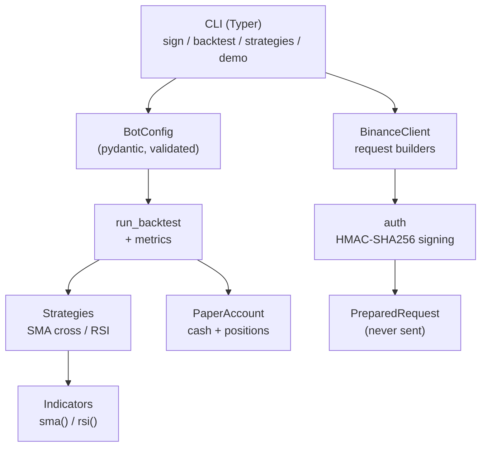

<p align="center">
  
</p>

<h1 align="center">Binance Trading Bot</h1>

<p align="center">
  <strong>Binance API trading bot with HMAC request signing, multiple order types, RSI/SMA strategies, and a metrics-driven paper backtester — in Python.</strong><br>
  Build correctly signed Binance requests offline, backtest a strategy on the paper account, then wire up live with confidence.
</p>

<p align="center">
  <em>Built and maintained by <a href="https://viprasol.com">Viprasol Tech</a> — Fintech Experts. Full-Stack Builders.</em>
</p>

<p align="center">
  <a href="https://github.com/Viprasol-Tech/binance-trading-bot/actions/workflows/ci.yml"></a>
  <a href="LICENSE"></a>
  
  
  
  
  
  <a href="https://t.me/viprasol_help"></a>
  <a href="https://github.com/Viprasol-Tech/binance-trading-bot/stargazers"></a>
</p>

---

> ## ⚠️ Disclaimer
> This software is for **educational purposes only** and is **not financial advice**. Cryptocurrency trading is highly volatile and involves substantial risk, including the **total loss of capital**. Paper-trading and backtest results are **not** indicative of future performance. Always test on the paper account or Binance testnet first and comply with Binance's terms and your local laws. **Use at your own risk** — Viprasol Tech assumes no responsibility for your trading results.

---

## ✨ Features

- 🔐 **Correct HMAC-SHA256 signing** — reproduces Binance's exact signed-endpoint scheme (ordered query string + `signature`), fully offline and deterministic.
- 🧱 **Request builders, not a black box** — every method returns a `PreparedRequest` dict (method, URL, headers, query string). Plug in any HTTP transport you like.
- 📊 **Market data endpoints** — klines/candlesticks with interval validation and the signed account/balances endpoint.
- 🧾 **Multiple order types** — market, limit, stop-loss-limit, and OCO, plus a signed cancel — all with `GTC`/`IOC`/`FOK` time-in-force validation.
- 📈 **Built-in strategies** — dual-SMA crossover and Wilder's RSI mean-reversion, exposed as pure, testable functions.
- 🧪 **Paper backtester with metrics** — total return, max drawdown, per-bar Sharpe, equity curve, and an optional taker fee — pure arithmetic, no network.
- 🛡️ **Typed config** — a frozen pydantic `BotConfig` validates your run eagerly and fails fast on bad input.
- 🖥️ **Rich CLI** — `sign`, `backtest`, `strategies`, `demo`, and `version` subcommands.
- ✅ **Quality bar** — `ruff`-clean, `mypy --strict`, and **81** real tests.

## 🚀 Quickstart

```bash
# 1. Clone and install (editable, with dev extras)
git clone https://github.com/Viprasol-Tech/binance-trading-bot.git
cd binance-trading-bot
python -m pip install -e ".[dev]"

# 2. See it work — no API keys, no network
binance-trading-bot demo
binance-trading-bot strategies
binance-trading-bot backtest --strategy sma_cross --fast 2 --slow 5
binance-trading-bot sign "symbol=BTCUSDT&side=BUY&type=MARKET&quantity=1"
```

> Requires Python 3.11+. The CLI never sends anything to Binance — it builds and signs requests locally and runs backtests in memory.

## 🧑‍💻 Usage

### Build a signed order request (offline)

```python
from binance_trading_bot import BinanceClient

client = BinanceClient("YOUR_API_KEY", "YOUR_API_SECRET")

# A limit order with explicit time-in-force.
req = client.prepare_limit_order(
    "BTCUSDT", "BUY", quantity=0.01, price=25_000.0, time_in_force="GTC"
)
print(req["method"], req["url"])
print(req["headers"])         # {'X-MBX-APIKEY': 'YOUR_API_KEY'}
print(req["query_string"])    # ...&signature=<hmac-sha256>

# An OCO order pairs a take-profit limit with a protective stop.
oco = client.prepare_oco_order(
    "BTCUSDT", "SELL", quantity=0.01,
    price=30_000.0, stop_price=24_000.0, stop_limit_price=23_900.0,
)

# Market data and balances.
klines = client.prepare_klines("BTCUSDT", "1h", limit=100)
account = client.prepare_account()
```

### Backtest a strategy with metrics

```python
from binance_trading_bot import BotConfig, run_backtest

prices = [float(p) for p in range(100, 140)]  # your closing-price series
config = BotConfig(symbol="BTCUSDT", strategy="sma_cross", fast=2, slow=5, fee_rate=0.001)

result = run_backtest(prices, config)
print(f"Return:   {result.total_return:+.2%}")
print(f"Drawdown: {result.max_drawdown:.2%}")
print(f"Sharpe:   {result.sharpe:.3f}")
print(f"Trades:   {result.trades}")
```

### Compute indicators directly

```python
from binance_trading_bot import rsi, sma, RsiStrategy, Signal

sma(prices, window=10)            # -> trailing mean
rsi(prices, period=14)            # -> Wilder's RSI in [0, 100]

strat = RsiStrategy(period=14, lower=30, upper=70)
assert strat.signal(prices) in (Signal.BUY, Signal.SELL, Signal.HOLD)
```

## 🏗️ Architecture



## 📚 API Reference

| Component | Symbol | Purpose |
|-----------|--------|---------|
| Signing | `sign_query`, `build_signed_query` | HMAC-SHA256 over the ordered query string |
| Client | `BinanceClient.prepare_public_request` | Unsigned market-data requests |
| Client | `BinanceClient.prepare_signed_request` | Signed TRADE / USER_DATA requests |
| Orders | `prepare_new_order` / `prepare_limit_order` | Market and limit orders |
| Orders | `prepare_stop_loss_limit_order` / `prepare_oco_order` | Stop-loss-limit and OCO |
| Orders | `prepare_cancel_order` | Signed order cancellation |
| Market data | `prepare_klines` / `prepare_account` | Candlesticks and balances |
| Strategies | `SmaCrossStrategy`, `RsiStrategy` | Signal generators |
| Indicators | `sma`, `rsi` | Pure indicator functions |
| Backtest | `run_backtest`, `BacktestResult` | Paper backtest + metrics |
| Metrics | `max_drawdown`, `sharpe_ratio` | Standalone metric helpers |
| Config | `BotConfig` | Typed, validated run configuration |
| Paper | `PaperAccount`, `Fill`, `Side` | In-memory spot account |

## 🗺️ Roadmap

- [x] HMAC-SHA256 request signing
- [x] Paper-trading account
- [x] SMA-cross and RSI strategies
- [x] Multiple order types (limit / stop / OCO) + time-in-force
- [x] Klines and account endpoint builders
- [x] Backtester with return / drawdown / Sharpe metrics
- [x] Typed `BotConfig`
- [ ] Pluggable live HTTP transport (httpx) behind a feature flag
- [ ] WebSocket market-data stream adapter
- [ ] Additional indicators (MACD, Bollinger Bands)
- [ ] CSV/Parquet historical-data loader for backtests

## ❓ FAQ

**Does this place real trades?**
No. Every builder returns a `PreparedRequest` dict and nothing is ever sent. You choose if/when to forward it to Binance with your own HTTP client.

**Is my API secret transmitted anywhere?**
No. The secret is used only locally to compute the HMAC signature. There is no network code in this package.

**Which order types are supported?**
Market, limit, stop-loss-limit, and OCO, each with `GTC`/`IOC`/`FOK` time-in-force where applicable, plus a signed cancel.

**Can I use the Binance testnet?**
Yes. Pass `base_url=TESTNET_BASE_URL` (or any custom URL) to `BinanceClient`.

**Are backtest results realistic?**
They are deterministic and include an optional taker fee, but assume fills at the bar price with no slippage or partial fills. Treat them as a sanity check, not a profit promise.

## 🤝 Contributing

Contributions are welcome! Please open an issue to discuss substantial changes first.

```bash
python -m pip install -e ".[dev]"
ruff check . && ruff format --check .
mypy src
PYTHONPATH=src python -m pytest -q
```

See [CONTRIBUTING.md](CONTRIBUTING.md) and our [Code of Conduct](CODE_OF_CONDUCT.md).

## Contact — Viprasol Tech Private Limited

- Website: [viprasol.com](https://viprasol.com)
- Email: [support@viprasol.com](mailto:support@viprasol.com)
- Telegram: [t.me/viprasol_help](https://t.me/viprasol_help) | WhatsApp: +91 96336 52112
- GitHub: [@Viprasol-Tech](https://github.com/Viprasol-Tech) | [LinkedIn](https://www.linkedin.com/in/viprasol/) | X [@viprasol](https://twitter.com/viprasol)

## License

[MIT](LICENSE) (c) 2025 Viprasol Tech Private Limited
